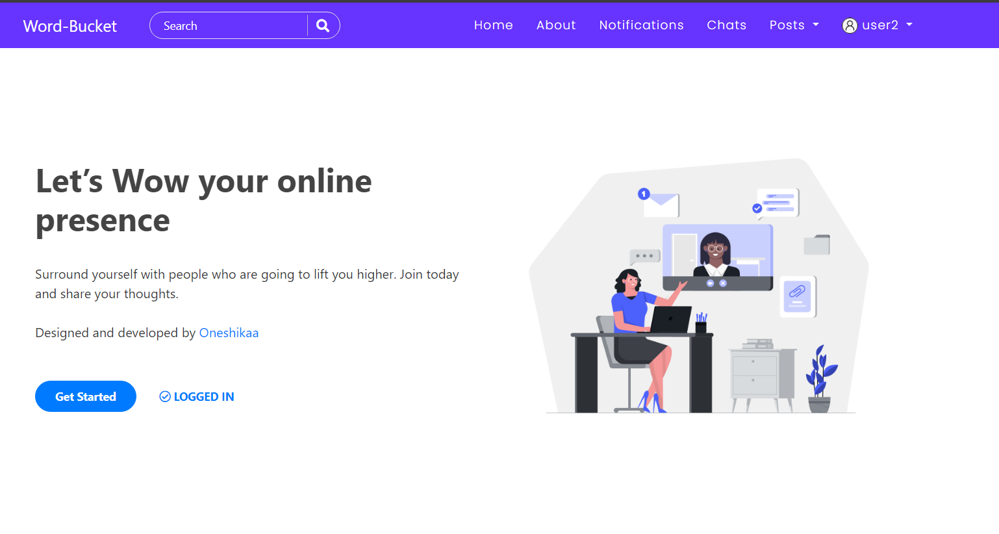

# Django Social Network



## Project Overview

The Django Social Network is a web application designed to facilitate social interaction and content sharing. Here's an outline of its key features:

### Scope
1. **User Management**
    - Authentication and registration
    - OAuth 2.0 integration for Google and Github sign-ins
    - User roles and permissions (e.g., regular user, admin)
2. **Profile Management**
    - Public profile view with customizable information
    - User can edit their profile details
    - Password recovery functionality for forgotten passwords
3. **Post Management**
    - Creation, editing, and deletion of posts
    - Customizable posts with text, pictures, and links
4. **Interaction Features**
    - Like and comment on posts
    - Reply to comments
    - Save posts for later viewing
    - Search functionality for posts
5. **Friendship Management**
    - Follow and unfollow users to view their posts
    - Send and accept friend requests
6. **Notifications**
    - Receive notifications for various activities (e.g., new likes, comments, friend requests)
7. **Real-time Communication**
    - Chat feature using websockets for instant messaging


## Installation Guide

### Requirements
- Python
- Django
- HTML, CSS, JavaScript
- PostgreSQL or any other supported database

### Steps to Run the Project Locally

1. **Clone the Repository:**
    ```bash
    git clone https://github.com/oneshikaa/SocialNetworking
    ```

2. **Install Dependencies:**
    ```bash
    pip install -r requirements.txt
    ```

3. **Apply Migrations:**
    ```bash
    python manage.py makemigrations
    python manage.py migrate
    ```

4. **Run the Development Server:**
    ```bash
    python manage.py runserver
    ```

5. **Access the Application:**
    Open a web browser and go to `http://127.0.0.1:8000/`.

## Product Details

### Product Perspective
SocialNetworking is developed as a standalone web application focused on fostering social interaction and content sharing among users.

### Product Features
The platform includes essential features such as user management, profile customization, post creation and interaction, friendship management, notifications, and real-time communication.


### User Classes and Characteristics
Users comprise regular users and administrators with varying levels of technical expertise and social networking experience. The platform is designed to be intuitive and user-friendly for users of all backgrounds.


### Operating Environment
The Django Social Network operates within a web-based environment, utilizing Django for the backend and supporting various browsers and operating systems for optimal accessibility.
